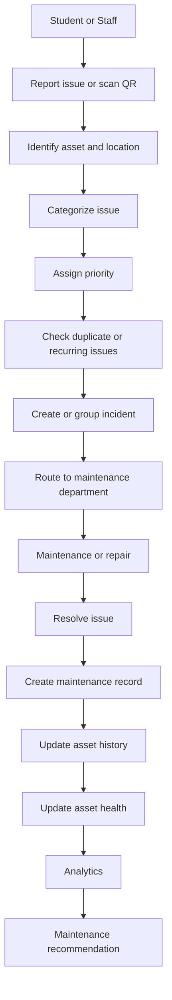

# Smart Campus Infrastructure & Issue Intelligence

## Project Status

| Area | Status |
| --- | --- |
| Repository and Git setup | Implemented |
| Backend Express foundation | In development |
| Frontend React/Vite foundation and home page | In development |
| Database, authentication, assets, issues, and analytics | Planned |
| Docker, Jenkins, and Prometheus | Planned progressively |

This six-member final-year capstone is a MERN-based platform for managing campus infrastructure and its maintenance lifecycle. Features marked **planned** are design goals, not completed functionality.

## What We Are Building

Traditional complaint systems treat every complaint as an isolated ticket. This project connects each issue to a physical campus asset and preserves its history. That lets the team identify repeated failures, duplicate reports, frequently failing assets, problem zones, asset health, maintenance patterns, and repair-versus-replacement situations.

Examples of managed assets include air conditioners, projectors, Wi-Fi equipment, electrical equipment, laboratory equipment, classroom infrastructure, and hostel infrastructure.

The goal is to help an administrator move from:

> Another complaint was received.

to:

> This specific asset has repeatedly failed and needs inspection or replacement.

## Core Principle

This is **not simply a complaint management application**. Its differentiator is the intelligence layer:

```text
Asset -> Historical issues -> Recurring failure detection -> Asset health
	  -> Infrastructure intelligence -> Better maintenance decisions
```

Duplicate and recurring issue detection, plus asset health scoring, will be rule-based first. AI is optional and must never be required for the core demonstration.

## Core Workflow



In simple terms, a person reports a problem or scans an asset QR code. The platform identifies the asset, records the problem, and checks whether similar reports already exist. Related reports can be grouped into an incident and sent to the correct maintenance team. After resolution, the repair history changes the asset health score and informs future maintenance decisions.

## User Roles

1. **Student** — Reports infrastructure problems and follows submitted issues.
2. **Staff** — Reports problems affecting teaching or administration.
3. **Maintenance Staff** — Receives assigned work, updates progress, and records repairs.
4. **Department Manager** — Oversees assets, work, and reporting for a maintenance department.
5. **Admin** — Oversees the platform, users, assets, and global reporting.

These are high-level responsibilities only. Detailed permissions are part of the API and authorization design phase and must be agreed before implementation.

## Planned Tech Stack

### Frontend

React, Vite, JavaScript, Tailwind CSS, React Router, and Axios.

### Backend

Node.js, Express.js, MongoDB, Mongoose, JWT, bcrypt, and Zod.

### Infrastructure

Docker, Docker Compose, Nginx, Jenkins, and Prometheus.

Infrastructure components will be introduced progressively. Docker, Nginx, Jenkins, and Prometheus are not required on day one of local feature development.

## Repository Structure

The target application layout is:

```text
smart-campus-infrastructure-intelligence/
├── client/
├── server/
├── docs/
├── .gitignore
├── README.md
├── docker-compose.yml
└── package.json
```

The current foundation uses `frontend/` and `backend/`. The target names `client/` and `server/` describe the same responsibilities while the monorepo is being aligned.

```text
server/
├── src/
│   ├── config/
│   ├── controllers/
│   ├── middleware/
│   ├── models/
│   ├── routes/
│   ├── services/
│   ├── utils/
│   ├── validators/
│   ├── app.js
│   └── server.js
├── .env.example
└── package.json

client/
└── src/
	├── components/
	├── pages/
	├── layouts/
	├── hooks/
	├── services/
	├── context/
	├── utils/
	├── routes/
	├── assets/
	├── App.jsx
	└── main.jsx
```

| Folder | Beginner-friendly purpose |
| --- | --- |
| `config` | Application configuration, database setup, and environment access. |
| `controllers` | Read HTTP requests, call services, and format responses. |
| `middleware` | Shared authentication, authorization, validation flow, and error handling. |
| `models` | Mongoose schemas and database model definitions. |
| `routes` | Endpoint paths and middleware/controller attachment only. |
| `services` | Business rules such as duplicate detection and health scoring. |
| `utils` | Small reusable helper functions. |
| `validators` | Zod schemas for incoming request data. |
| `components` | Reusable frontend UI pieces. |
| `pages` | Major frontend screens. |
| `layouts` | Shared page structures. |
| `hooks` | Reusable React logic. |
| `services` | Frontend API communication. |
| `context` | Shared application state such as the current user. |
| `routes` | Frontend navigation and protection. |
| `assets` | Images, icons, and other static frontend assets. |

## Six-Member Team Ownership

| Developer | Initial responsibility |
| --- | --- |
| Developer 1 | Asset Registry + QR |
| Developer 2 | Issue Reporting + Categorization |
| Developer 3 | Duplicate / Recurring Issue Detection |
| Developer 4 | Maintenance Workflow + Admin |
| Developer 5 | Analytics + Dashboard |
| Developer 6 | DevOps + Platform Reliability |

Ownership means responsibility for leading and maintaining a feature. It does **not** mean that a developer alone may edit only certain folders. Everyone follows the shared architecture and API contracts. Assets support issue reporting; issues support duplicate detection; incidents and maintenance records support analytics and health scoring.

## Git Workflow

`main` is the production and stable branch. Developers must not push directly to `main`.

### Start Work

Replace the repository URL with the actual GitHub URL if needed.

```bash
git clone <REPOSITORY_URL>
cd smart-campus-infrastructure-intelligence
git checkout main
git pull origin main
git checkout -b feature/asset-qr
```

1. `git clone` downloads the repository.
2. `cd` moves into the project directory.
3. `git checkout main` selects the stable branch.
4. `git pull origin main` downloads the latest stable work.
5. `git checkout -b ...` creates and selects your feature branch.

Tell the team before starting: `I am working on feature/asset-registry.`

### Save and Publish Work

```bash
git status
git add .
git commit -m "feat: add asset QR generation"
git push -u origin feature/asset-qr
```

`git status` shows changed files. `git add .` stages changes. `git commit` saves a focused checkpoint. `git push` publishes your branch to GitHub.

After pushing, open the repository on GitHub, choose **Compare & pull request**, select your feature branch as the source and `main` as the target, describe the change, and request at least one review. Merge only after approval and successful checks. Delete the feature branch after it is merged.

## Branch Naming

Names should be short, lowercase, and use hyphens.

```text
feature/authentication
feature/asset-registry
feature/issue-reporting
feature/duplicate-detection
feature/maintenance-workflow
feature/admin-dashboard
feature/analytics
feature/qr-system
fix/login-validation
fix/issue-status
docs/api-documentation
chore/docker-setup
chore/jenkins-pipeline
```

## Commit Convention

```text
feat: add asset creation API
feat: add issue reporting form
fix: correct JWT validation
docs: update API documentation
refactor: simplify issue service
test: add asset controller tests
chore: configure Docker
```

- `feat` — a new capability.
- `fix` — a bug correction.
- `docs` — documentation only.
- `refactor` — structure changes without intended behavior changes.
- `test` — tests or test infrastructure.
- `chore` — tooling, configuration, or maintenance.

## Pull Request Rules

- Never directly merge unreviewed work into `main`.
- Use a clear title and explain what changed.
- Mention the related issue or task.
- Describe the testing performed.
- Keep PRs reasonably small.
- Do not mix unrelated features in one PR.
- Resolve merge conflicts before requesting final approval.

Use this template:

```markdown
## What changed?

## Why?

## How was it tested?

## Screenshots (if UI)

## Checklist

- [ ] Code works locally
- [ ] No secrets committed
- [ ] Existing functionality still works
- [ ] Tests updated if required
- [ ] README/docs updated if required
```

## Getting the Latest Code

Synchronize your branch regularly:

```bash
git checkout main
git pull origin main
git checkout feature/your-branch
git merge main
```

If Git reports a conflict, open each conflicted file, decide which code should remain, remove `<<<<<<<`, `=======`, and `>>>>>>>`, and test the result:

```bash
git add <resolved-file>
git commit -m "chore: resolve merge conflict"
```

Do not randomly delete files or rewrite working code to escape a conflict. Ask the relevant module owner when the correct choice is unclear.

## Environment Variables and Secrets

- Never commit `.env`.
- Use `.env.example` for variable names without real values.
- Each developer creates their own local `.env`.
- Never put passwords, JWT secrets, MongoDB credentials, API keys, or tokens in source code.

Typical macOS/Linux setup:

```bash
cp server/.env.example server/.env
```

On Windows, use the equivalent copy command or File Explorer. The exact path may differ while the repository uses the current `backend/` scaffold.

## Local Development

The exact root scripts will be finalized with the monorepo setup. The current scaffold can be started with:

```bash
# Terminal 1: backend
npm --prefix backend install
npm --prefix backend run dev

# Terminal 2: frontend
npm --prefix frontend install
npm --prefix frontend run dev
```

Expected addresses:

- Frontend: `http://localhost:5173/`
- Backend: `http://localhost:5000/`

Basic sequence:

1. Clone the repository.
2. Install frontend and backend dependencies.
3. Create local environment variables when the example file is available.
4. Start MongoDB when database features are introduced.
5. Start the backend.
6. Start the frontend.
7. Verify the API health endpoint when it has been implemented.
8. Verify frontend-to-backend communication.

Do not invent health endpoints or scripts before they are documented and implemented.

## Backend Architecture Rules

- **Routes** define endpoint paths and attach middleware/controllers.
- **Controllers** handle HTTP request and response logic.
- **Services** contain business logic.
- **Models** define MongoDB schemas.
- **Validators** validate incoming request data.
- **Middleware** handles authentication, authorization, validation flow, and errors.
- **Utils** contain reusable helpers.

Do not put large business logic inside routes. Do not scatter database queries across unrelated files. Do not duplicate the same rule in multiple controllers.

```text
Route -> Middleware -> Controller -> Service -> Model -> MongoDB
```

The planned standard response shape is `{ success, data, error }`.

## Frontend Architecture Rules

- **Pages** are major screens.
- **Components** are reusable UI pieces.
- **Layouts** provide shared page structures.
- **Hooks** hold reusable React logic.
- **Services** wrap API communication.
- **Context** holds shared application state.
- **Utils** contain helper functions.
- **Routes** handle navigation and protection.

Do not create huge components. Keep API calls outside UI components when practical. Use role-aware layouts and protected routes only after the authorization contract is agreed.

## API Development Rule

Before implementing a new API feature:

1. Confirm the required data model.
2. Confirm the endpoint.
3. Confirm the request and response structure.
4. Confirm authorization.
5. Confirm validation.
6. Implement the backend.
7. Test the backend.
8. Integrate the frontend.
9. Test the complete workflow.
10. Update API documentation.

Do not invent random endpoints independently. When an API contract changes, discuss and document the change before implementation.

## Recommended Development Order

1. Repository and project foundation
2. Database structure
3. Authentication and authorization
4. Users and roles
5. Locations
6. Assets
7. QR system
8. Issue reporting
9. Issue lifecycle
10. Maintenance workflow
11. Duplicate and recurring issue detection
12. Asset health
13. Analytics
14. Notifications
15. AI and stretch features
16. Docker
17. Jenkins CI/CD
18. Prometheus monitoring
19. Testing and security hardening
20. Deployment and final documentation

Do not jump to advanced features before foundational features are stable and manually testable.

## MVP and Stretch Scope

### Must Have

- Authentication and roles
- Assets and locations
- QR identification
- Issue reporting and lifecycle
- Maintenance history
- Department assignment
- Admin dashboard
- Duplicate and recurring issue detection
- Basic asset health

### Stretch

- Heatmap
- Predictive maintenance
- AI issue classification
- AI-generated reports
- Advanced notifications
- Advanced analytics

The project must remain fully demonstrable without stretch features.

## Data and Intelligence Plan

The planned core entities are User, Asset, Location, Department, Issue, Incident, MaintenanceRecord, Feedback, and Notification. An issue is one raw report. An incident groups issues pointing to the same underlying asset problem; incidents are auto-created rather than manually created.

The initial rule-based intelligence will:

- Find open issues for the same asset within a configurable time window.
- Group repeated reports into an incident.
- Count recent resolved failures to detect recurring problems.
- Track failure counts and calculate an asset health score from 0 to 100.
- Group issues by building or location to identify problem zones.
- Recommend repair or replacement using configurable thresholds.

Thresholds must be configuration values rather than unexplained hard-coded numbers.

## Rules We Do Not Break

1. Never push directly to `main`.
2. Never commit `.env`.
3. Pull the latest `main` before starting work.
4. Test before opening a PR.
5. Do not randomly change another person’s module.
6. Do not rename shared files or directories without discussing it.
7. Do not introduce a dependency without a reason.
8. Do not duplicate existing functionality.
9. Do not bypass validation or authentication.
10. Do not commit broken code just to “save progress”.
11. Keep commits focused.
12. Communicate API contract changes.
13. Document important architectural decisions.
14. Ask before making large structural changes.

## When Something Breaks

1. Read the full error, including the first useful line.
2. Check what changed recently.
3. Pull the latest `main` safely.
4. Reinstall dependencies if appropriate.
5. Check environment variables.
6. Check backend logs.
7. Check the frontend browser console.
8. Check the MongoDB connection when database work is involved.
9. Reproduce the issue with the smallest useful steps.
10. Ask the module owner or team before changing unrelated code.

Do not randomly delete files, remove `node_modules`, or rewrite working code because of one error. Understand the failure first and record the fix if it is likely to help the team again.

## Definition of Done

A feature is complete only when:

- [ ] Code is implemented.
- [ ] Validation is added.
- [ ] Authentication and authorization are checked.
- [ ] The API is tested.
- [ ] Frontend integration is completed where applicable.
- [ ] Error handling is added.
- [ ] Existing functionality still works.
- [ ] No secrets are committed.
- [ ] Documentation is updated where needed.
- [ ] The PR is reviewed and approved.
- [ ] The work is merged into `main`.

## Team Communication

Use short, technical updates:

```text
Before starting: I am working on feature/asset-registry.
When blocked: I am blocked by X because Y.
When API changes: Endpoint X changed from A to B.
When completing: PR #123 is ready for review.
```

## Quick Start for Team Members

The minimum safe sequence is:

```text
clone -> pull main -> create a feature branch -> work -> test
	-> commit -> push branch -> open Pull Request -> review -> merge
```

```bash
git clone <REPOSITORY_URL>
cd smart-campus-infrastructure-intelligence
git checkout main
git pull origin main
git checkout -b feature/your-feature
git status
# Make and test your changes.
git add .
git commit -m "feat: describe the focused change"
git push -u origin feature/your-feature
```

Then open a Pull Request on GitHub from `feature/your-feature` into `main`, request a review, address feedback, and merge only when approved.

- **Pages** are major screens.
- **Components** are reusable UI pieces.
- **Layouts** provide shared page structures.
- **Hooks** hold reusable React logic.
- **Services** wrap API communication.
- **Context** holds shared application state.
- **Utils** contain helper functions.
- **Routes** handle navigation and protection.

Do not create huge components. Keep API calls outside UI components when practical. Use role-aware layouts and protected routes only after the authorization contract is agreed.